<div align="center">

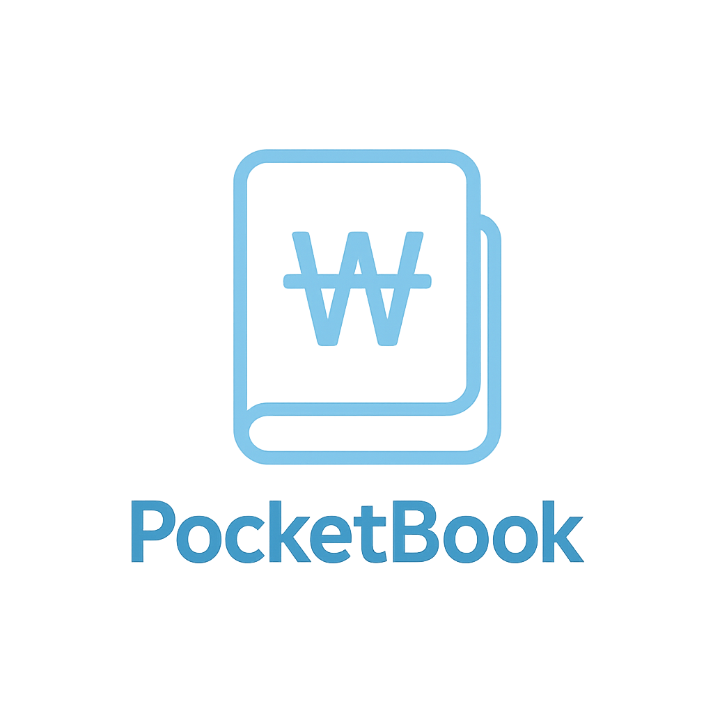

# PocketBook 💸

**빠르게 기록하는 일상 가계부 — iOS · Swift · UIKit · SwiftData**

> 카테고리 한 번 탭 → 금액 입력 → 저장. 하루 평균 **30초** 안에 끝나는 지출 기록.


</div>


<div align="center">
<table>
  <tr>
    <td align="center"><br><b>기록</b></td>
    <td align="center">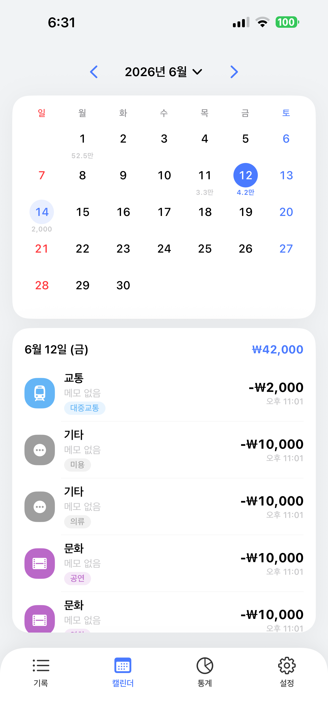<br><b>캘린더</b></td>
    <td align="center">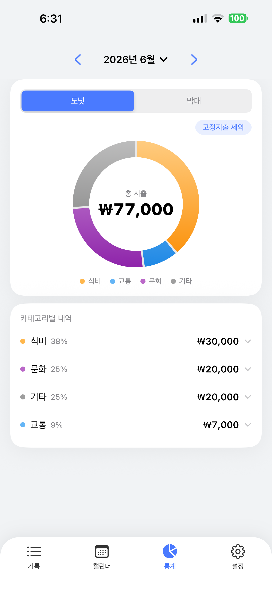<br><b>통계</b></td>
    <td align="center">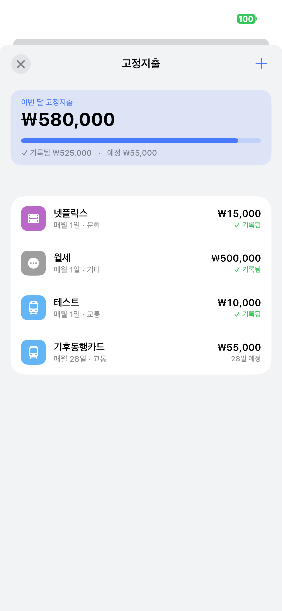<br><b>고정지출</b></td>
  </tr>
</table>
</div>

---

## 목차

- [소개](#-소개)
- [프로젝트 배경 및 목적](#-프로젝트-배경-및-목적)
- [주요 기능](#-주요-기능)
- [스크린샷](#-스크린샷)
- [기술 스택](#-기술-스택)
- [아키텍처](#-아키텍처)
- [구현 하이라이트](#-구현-하이라이트)
- [프로젝트 구조](#-프로젝트-구조)
- [시작하기](#-시작하기)
- [시연 영상](#-시연-영상)

---

## 📖 소개

PocketBook은 **기록의 마찰을 줄이는 것** 하나에 집중한 개인 가계부 앱입니다.
앱을 켜고 `+` → 카테고리 칩 한 번 탭 → 금액 입력 → 저장이면 끝. 매달 빠져나가는 월세·구독료는 **고정지출**로 등록해두면 결제일마다 자동으로 기록됩니다.

- 🎯 **빠른 입력** — 큰 금액 키패드 + 빠른 금액 버튼, 1-탭 카테고리 칩
- 🔄 **고정지출 자동화** — 결제일이 지나면 알아서 기록 (중복 없이)
- 📅 **캘린더 · 📊 통계** — 하루 단위부터 카테고리·태그별 분석까지
- 💰 **예산 알림** — 80% · 100% 도달 시 로컬 알림
- 🌙 **다크 모드** · 햅틱 · 부드러운 애니메이션
- 📦 **외부 라이브러리 0** — 차트·탭바 전부 Core Graphics / Core Animation 직접 구현

---

## 🎯 프로젝트 배경 및 목적

### 1. 프로젝트 정의
본 프로젝트는 사용자의 인지적 부하(Cognitive Load)를 최소화하는 직관적인 UI/UX와 로컬 데이터베이스(`SwiftData`) 기반의 지능형 스케줄링 알고리즘을 융합한 **사용자 중심의 일상 가계부 애플리케이션**입니다. 기존 재무 관리 앱의 복잡한 입력 단계를 단축하고, 구독 경제 시대에 맞춘 고정지출 자동 생성 및 무결성 방어 시스템을 제공하여 지속 가능한 개인 재무 관리를 돕는 것을 목표로 합니다.

### 2. 프로젝트 배경
- **기존 앱의 높은 입력 피로도 및 인지적 마찰(Friction):** 가계부 앱의 핵심은 '지속적인 기록'에 있으나, 대다수 앱은 다수의 화면 이동과 복잡한 폼(Form) 작성을 요구합니다. 이에 즉각적인 숫자 입력과 시각적 위계가 최적화된 새로운 인터페이스가 필요했습니다.
- **고정지출 관리의 복잡성 증가:** OTT, 주거비 등 고정지출 비중이 커짐에 따라, 이를 수동 기록할 경우 누락/중복이 발생합니다. 또한, 특정 월에 결제를 건너뛴 경우(Skipped) 이를 시스템이 인지하지 못해 데이터 정합성이 깨지는 기술적 한계를 극복해야 했습니다.
- **직관적인 재무 모니터링의 부재:** 사용자가 앱 실행 즉시 잔여 예산과 소비 흐름을 직관적으로 파악할 수 있도록 데이터 시각화 및 제스처 기반의 탐색 환경이 필요했습니다.

### 3. 프로젝트 목표
- **마이크로 인터랙션을 통한 마찰 최소화 (Zero-Friction UX):** 화면 최상단 '히어로(Hero) 금액 뷰' 및 '+1만' 등의 퀵 버튼을 도입해 물리적인 타이핑 횟수를 감축하고, 카드형 레이아웃으로 조작 직관성을 극대화합니다.
- **지능형 스케줄링 기반의 자동화 인프라 구축:** 지정된 규칙에 따라 지출 내역을 자동 생성(`materialize`)하고, 유저가 삭제한 항목은 로컬 DB에 영구 기록(`skippedMonths`)하여 '좀비 데이터 부활'을 원천 차단하는 무결성 방어 로직을 설계합니다.
- **데이터 시각화 및 안정적 예외 처리 도입:** `CoreGraphics`를 활용해 소비 패턴을 렌더링하고, 다중 항목 연속 삭제 시 메모리 누수(Retain Cycle) 없이 LIFO(후입선출) 복구가 가능한 `UndoCenter` 배치 처리 시스템을 구축합니다.

---

## ✨ 주요 기능

### 1. 빠른 지출 기록
큰 `₩` 라벨을 탭하면 숫자 키패드가 올라오고, `+1천 / +5천 / +1만 / +5만` 버튼으로 더 빠르게 입력합니다.
식비·교통·문화·기타 **카테고리 칩**을 한 번 탭하고, 자주 쓴 순으로 정렬되는 **태그**를 골라 저장합니다. 금액 없이 저장하면 **흔들림 피드백**으로 막아줍니다.

<!-- 📸 docs/screenshots/add.png  (지출 등록 화면) -->
<div align="center">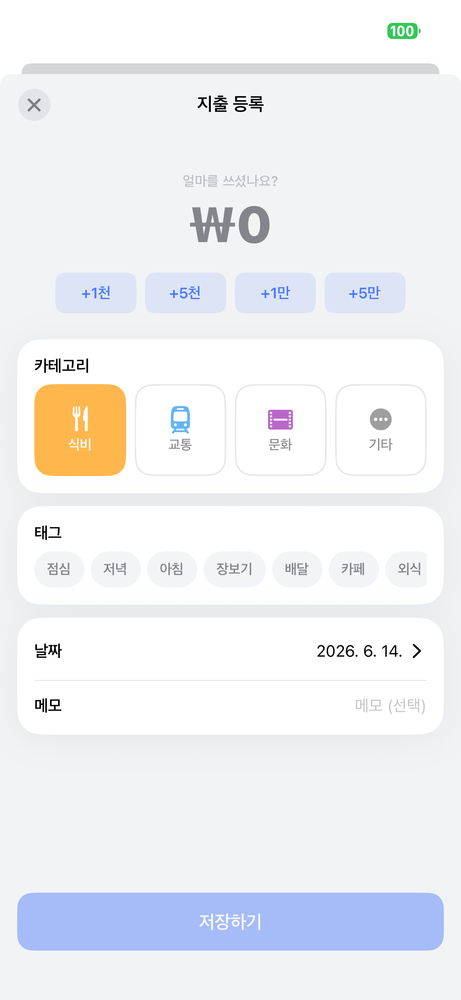</div>

### 2. 고정지출 자동 관리
월세·넷플릭스처럼 매달 반복되는 지출을 **규칙**으로 등록하면, 결제일이 지날 때 자동으로 기록됩니다.

- 앱 실행 / 백그라운드 복귀 / 자정 경과 시점에 **결제일이 지난 항목만** 자동 생성
- **중복 방지(멱등)** — 같은 달에 두 번 기록되지 않음
- 자동 생성분을 삭제하면 "이번 달만 건너뛰기"로 처리하고, **되돌리기**도 지원
- **일시정지 / 재개**, 이번 달 `기록됨 / 예정` 금액 분리 표시

<!-- 📸 docs/screenshots/recurring_edit.png  (고정지출 등록/허브) -->
<div align="center">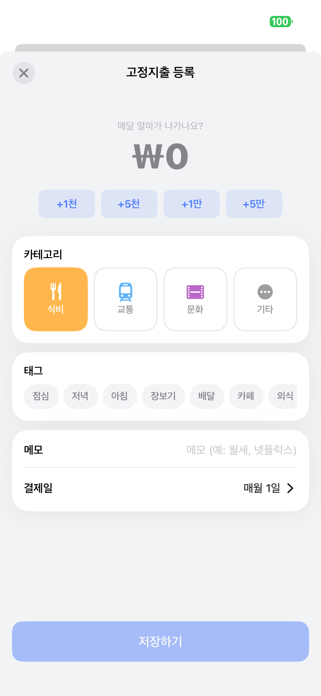 <align="center"></div>

### 3. 캘린더
한 달을 그리드로 보고, 지출이 있는 날엔 **일별 합계**가 표시됩니다. 날짜를 탭하면 그날의 내역이 아래에 펼쳐집니다.

<div align="center"></div>

### 4. 통계 & 인사이트
**도넛 ↔ 막대** 차트를 토글하고, 카테고리별 내역을 탭하면 **태그별 상세**가 펼쳐집니다.

- `고정지출 제외` 필터로 변동지출만 분석
- **지난달 대비 증감**(▲/▼ %)과 **하루 평균** 인사이트
- 카테고리별 색·비중 범례

<!-- 📸 docs/screenshots/stats_bar.png  (막대 차트 모드) -->
<div align="center">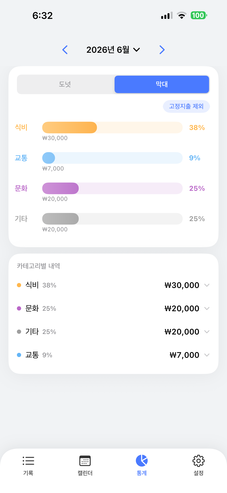</div>

### 5. 예산 & 알림
월 예산을 정하면 메인 화면에 **진행바**(안전·주의·초과 색상)가 뜨고, **80% · 100%** 도달 시 단계별로 한 번씩 로컬 알림을 보냅니다.

### 6. 디테일
- **스와이프 삭제 + 되돌리기** — 실수해도 토스트의 `되돌리기`로 즉시 복구 (연속 삭제는 묶어서 한 번에)
- **다크 모드** 완전 대응
- **햅틱 피드백** & 카운트업 / 막대 성장 / 도넛 채움 애니메이션
- **커스텀 곡선 탭바**

---

## 📸 스크린샷

<!-- =========================================================
     라이트 / 다크 모드 비교 (docs/screenshots/ 에 넣기)
========================================================= -->
| 라이트 모드 | 다크 모드 |
|:---:|:---:|
| 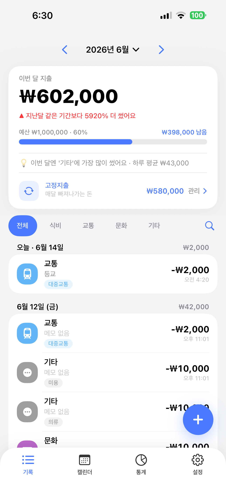 | 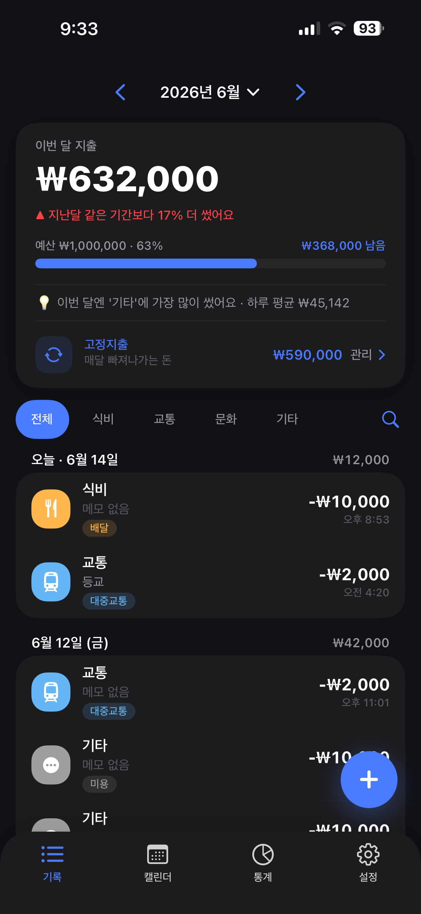 |


| 설정 | 검색·필터 |
|:---:|:---:|
| 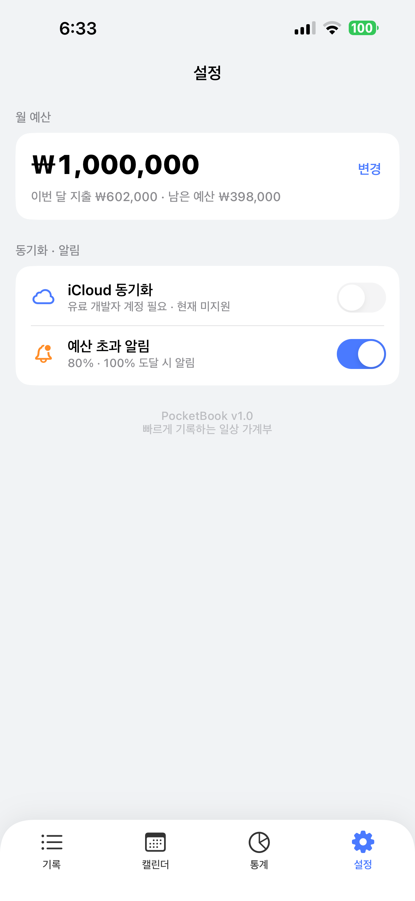 | 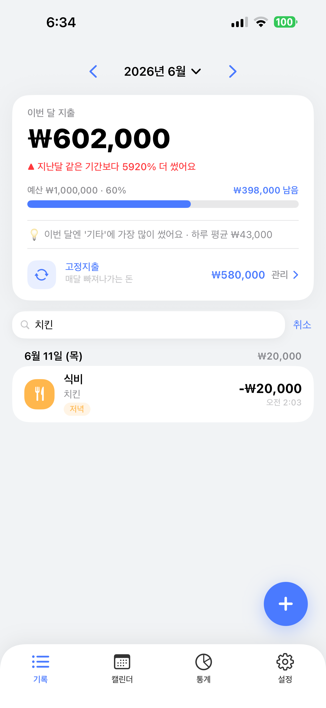 |


---

## 🛠 기술 스택

| 분류 | 사용 기술 |
|---|---|
| **언어** | Swift 5 |
| **UI** | UIKit (100% 프로그래매틱 Auto Layout, Storyboard 미사용) |
| **영속성** | SwiftData (`@Model`, `ModelContainer` / `ModelContext`) + `UserDefaults`(설정·예산·태그 빈도) |
| **그래픽** | Core Graphics · Core Animation (`CAShapeLayer`, `CAGradientLayer`, `CADisplayLink`) |
| **시스템** | `UNUserNotifications`(예산 알림), `UISheetPresentationController`(하프 시트) |
| **의존성** | **없음** (서드파티 라이브러리 0) |
| **개발 환경** | Xcode 15.4 · macOS Sonoma · iPhone 15 |

---

## 🏗 아키텍처

```
┌──────────────────────────────────────────────────────┐
│  Presentation   ViewControllers · Views · DesignSystem │
│        │  NotificationCenter (변경 통보)                 │
│  Domain/State   ExpenseStore · RecurringStore ·         │
│        │        SettingsStore   (@MainActor 싱글톤)       │
│        │  ModelContext                                   │
│  Persistence    SwiftData (@Model)  ·  UserDefaults      │
└──────────────────────────────────────────────────────┘
```

**데이터 모델 (SwiftData)**
- `Expense` — 개별 지출. `@Attribute(.unique) id`, `@Transient category`(enum ↔ rawValue 변환), 고정지출 연결용 `recurringID`.
- `RecurringExpense` — 매월 반복 '규칙'. 결제일(`dayOfMonth`), 건너뛴 달 원장(`skippedMonths`), 말일 보정 로직 내장.
- `PocketBookContainer` — `ModelContainer`를 단일 소유, 모든 스토어가 공유.

**상태 관리**
- `ExpenseStore` / `RecurringStore` / `SettingsStore` — `@MainActor` 싱글톤. `ModelContext`로 CRUD하고 변경 시 `NotificationCenter`로 브로드캐스트(`expensesDidChange` · `recurringDidChange` · `settingsDidChange`) → 각 화면 자동 갱신.

**디자인 시스템**
- `Theme` — 컬러(다크 모드 대응), 스페이싱, 라운드, 타이포(금액은 monospaced digit), 그림자 토큰.
- 공용 컴포넌트 — `CardView`, `MonthNavigatorView`, `CardFormViewController`, `AmountInputView`, `Toast`, `Haptic`.

> ℹ️ iCloud(CloudKit) 동기화는 컨테이너 구조만 마련되어 있고, 유료 개발자 계정이 필요해 현재 비활성 상태입니다.

---

## 💡 구현 하이라이트

- **고정지출 자동 생성(Materialization)** — 결제일이 지난 규칙을 **멱등하게 1회만** `Expense`로 구체화. 사용자가 자동 생성분을 삭제하면 `skippedMonths`에 기록해 재생성을 막고, 되돌리면 해제. "껐다 켜도 두 번 안 생기는" 정합성을 보장.
- **파괴적 액션 일관성** — 기록·캘린더 어느 화면에서 지우든 **동일한 되돌리기 UX** (공용 `UIViewController` 확장). 연속 삭제는 `UndoCenter`가 한 토스트로 묶어 이전 되돌리기가 사라지지 않게 처리.
- **순수 Core Graphics 차트** — 도넛은 `CAShapeLayer` stroke를 순차 애니메이션, 막대는 `draw(_:)` + `CADisplayLink` progress로 자라남. 외부 차트 라이브러리 0.
- **커스텀 곡선 탭바** — `UIBezierPath`로 그린 `CAShapeLayer` 배경 + 선택 시 바운스 애니메이션.
- **성능 · 안정성** — `DateFormatter` 캐싱(셀 스크롤 최적화), `CADisplayLink` 약한 프록시로 retain cycle 차단, `shadowPath` 지정으로 그림자 렌더 비용 제거, iOS 17 `registerForTraitChanges`로 다크 모드 색상 갱신.
- **모듈화** — 세 탭이 공유하던 월 네비게이션, 두 입력 폼의 공통 골격을 재사용 컴포넌트로 추출해 중복 제거.

---

## 🚀 트러블 슈팅 & 기술적 고민 (Troubleshooting)

### 1. 고정지출 '좀비 부활' 및 이중 청구 방지
- **문제**: 자동 생성된 고정지출을 사용자가 "이번 달은 안 냈어" 하고 삭제해도, 앱을 다시 켜면 스케줄러가 '이번 달 내역이 없다'고 판단해 다시 생성해 버리는 데이터 정합성 문제 발생.
- **해결**: `RecurringExpense` 모델에 `skippedMonths` 배열을 추가. 유저가 삭제할 때 해당 연/월 키(예: "2026-06")를 마킹하여, 스케줄러 루프가 돌 때 마킹된 달은 자동 생성을 `continue` 하도록 방어 로직 설계.
- **효과**: 극한의 엣지 케이스에서도 이중 청구되거나 지운 내역이 살아나는 현상을 100% 차단.

### 2. 커스텀 Toast 알림의 메모리 누수(Retain Cycle) 해결
- **문제**: 지출 삭제 후 나타나는 '되돌리기(Undo)' 토스트를 여러 번 띄울 때마다 메모리 릭(Leaks) 발생. 
- **원인 분석**: Toast의 `Container` 뷰가 `UIButton`을 담고 있고, 버튼의 `UIAction` 클로저 내부에서 `dismiss` 애니메이션을 위해 컨테이너를 다시 강참조(Strong Reference)하는 순환 참조 발견.
- **해결**: 클로저 캡처 리스트에 `[weak container]`를 명시하여 참조 고리를 끊고, 이전 토스트 객체를 추적해 스택이 겹치지 않도록 방어 코드 추가.

### 3. 금액 입력 모듈(AmountInputView) 컴포넌트화
- **문제**: 일반 지출 등록과 고정지출 등록 화면 양쪽에서 '금액 입력 키패드', '빠른 추가 버튼' 등의 UI/로직이 수십 줄씩 중복됨.
- **해결**: 재사용성을 높이고자 해당 로직과 뷰를 `AmountInputView`라는 독립적인 컴포넌트로 분리. 델리게이트/클로저 패턴(`onChanged`)을 사용해 ViewController와의 결합도를 낮춤.

---

## 📂 프로젝트 구조

```
PocketBook/
├── AppDelegate.swift
├── Models/                  # SwiftData @Model
│   ├── Expense.swift
│   └── RecurringExpense.swift
├── Store/                   # @MainActor 싱글톤 + 영속성
│   ├── ExpenseStore.swift
│   ├── RecurringStore.swift
│   ├── SettingsStore.swift
│   ├── PocketBookContainer.swift
│   ├── Storage.swift
│   └── TagLibrary.swift
├── ViewControllers/
│   ├── MainTabBarController.swift
│   ├── ListViewController.swift          # 기록
│   ├── CalendarViewController.swift      # 캘린더
│   ├── StatsViewController.swift         # 통계
│   ├── SettingsViewController.swift      # 설정
│   ├── AddViewController.swift           # 지출 등록/수정
│   ├── CardFormViewController.swift      # 입력 폼 공통 베이스
│   ├── RecurringListViewController.swift # 고정지출 허브
│   ├── RecurringEditViewController.swift # 고정지출 등록/수정
│   ├── MonthPickerViewController.swift
│   └── SplashViewController.swift
├── Views/
│   ├── CurvedTabBar.swift                # 커스텀 곡선 탭바
│   ├── DonutChartView.swift / BarChartView.swift
│   ├── AmountInputView.swift             # 금액 키패드 블록
│   ├── MonthNavigatorView.swift          # 월 이동 헤더 (공용)
│   ├── CardView.swift                    # 그림자 카드 (공용)
│   ├── ExpenseCell.swift / CalendarDayCell.swift
│   ├── Toast.swift / EmptyStateView.swift
│   └── ...
├── DesignSystem/
│   └── Theme.swift                       # 컬러·타이포·스페이싱·햅틱 토큰
├── Extensions/
│   ├── Formatters.swift                  # 캐시된 포매터
│   ├── UIViewController+Helpers.swift    # 삭제+되돌리기·presentOnce
│   └── ...
└── Services/
    └── NotificationService.swift         # 예산 초과 로컬 알림
```

---

## 🚀 시작하기

**요구사항**
- Xcode 15.4 이상
- iOS 17.0 이상 (실기기 또는 시뮬레이터)

**실행**
```bash
git clone https://github.com/mooksu2/Pocket_Book.git
cd Pocket_Book
open PocketBook.xcodeproj
```
1. Xcode에서 프로젝트를 엽니다.
2. `Signing & Capabilities`에서 본인 **Team**을 선택합니다.
3. 타깃 기기를 선택하고 `⌘R`로 실행합니다.

> 알림(예산 초과) 기능을 테스트하려면 설정 화면에서 알림 권한을 허용하세요.

---

## 🎬 시연 영상


<div align="center">

[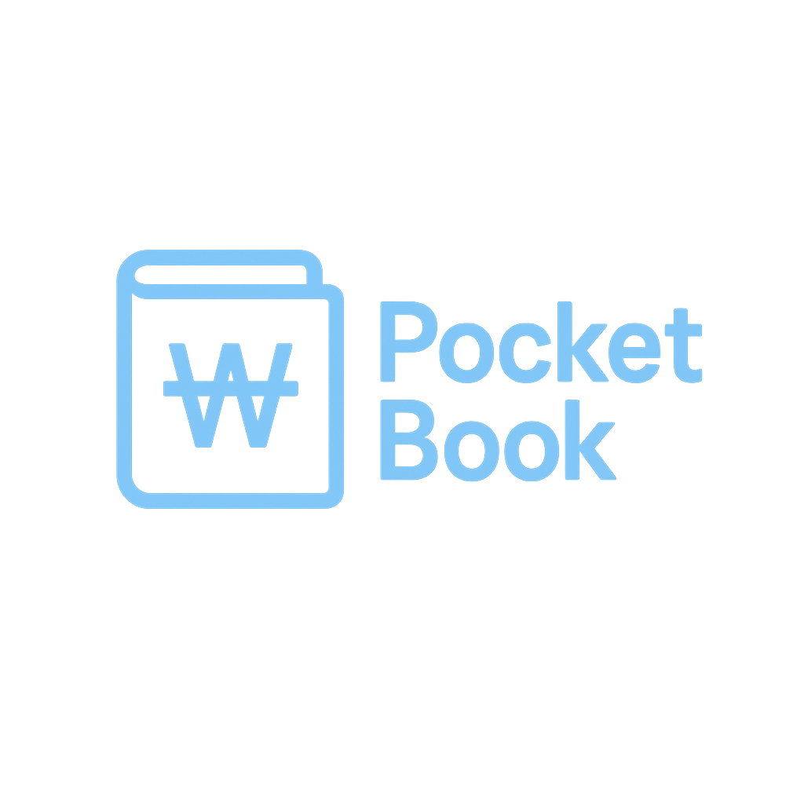](https://youtu.be/MyEMXMI3kG8)

▶️ **이미지를 클릭하면 유튜브 시연 영상으로 이동합니다**

</div>

---

<div align="center">
<sub>Made with ❤️ using UIKit & SwiftData</sub>
</div>
